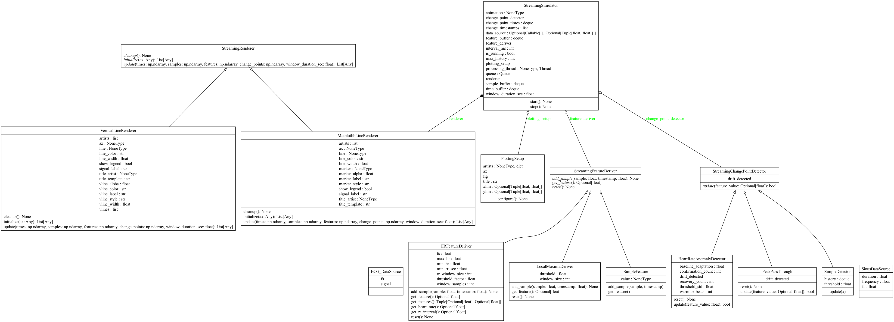

# StreamSim
A flexible, multi-threaded streaming framework for real-time time-series visualization with pluggable feature extraction, change point detection, and rendering components.

[](https://fenna.github.io/stream/)


## Overview
StreamSim provides a producer-consumer architecture for processing streaming data with:

- Real-time visualization using Matplotlib animations
- Pluggable components for feature derivation, anomaly detection, and rendering
- Thread-safe data flow between processing and rendering threads
- Support for multiple signal types (ECG, sinusoidal waves, and custom signals)


## project structure

```
├── __init__.py
├── core/
│   ├── __init__.py
│   ├── interfaces.py      # Abstract base classes
│   ├── simulator.py       # StreamingSimulator
│   └── config.py          # PlottingSetup, configuration dataclasses
├── features/
│   ├── __init__.py
│   ├── simple.py          # SimpleFeatureDeriver
│   ├── heart_rate.py      # HeartrateDeriver
│   ├── local_maxima.py    # LocalMaximaDeriver
├── detectors/
│   ├── __init__.py
│   ├── simple.py          # SimpleDetector
│   ├── hr_anomaly.py      # detects heart rate anomaly
│   └── passthrough.py     # PeakPassThrough
├── renderers/
│   ├── __init__.py
│   ├── matplotlib_line.py # MatplotlibLineRenderer
│   ├── vline.py           # vertical line for anomalies
├── sources/
│   ├── __init__.py
│   └── sinus.py           # sinus DataSource
│   └── ecg.py             # ECG DataSource
└── examples/
    ├── __init__.py
    ├── sinus_demo.py      # run_sinus_example
    └── ecg_demo.py        # run_rpeak_example
```


## Installation
```
# Clone the repository
git clone https://github.com/fenna/stream.git
cd stream
```

## Install dependencies
```
pip install -r requirements.txt
```

### Dependencies
- numpy - Numerical computations
- matplotlib - Visualization and animations
- wfdb - ECG signal loading (optional, for real ECG data)

## Quick Start

### ECG R-Peak Detection Demo

```
python3 -m streamsim.src.examples.ecg_demo
```

This demonstrates:

- Real ECG signal processing with R-peak detection
- Heart rate calculation and anomaly detection
- Vertical line markers for detected anomalies
- Dynamic title showing current heart rate

### Sinus Wave Peak Detection Demo
```
python3 -m streamsim.src.examples.sinus_demo
```

This demonstrates:

- General-purpose peak detection on synthetic signals
- Red dot markers on detected local maxima
- Configurable signal frequency and sampling rate

## Architecture

```
┌──────────────┐     ┌────────────────────┐     ┌──────────────────┐
│ Data Source  │────▶│ Feature Deriver    │────▶│ Detector         │
│ (ECG/Sinus)  │     │ (extracts HR/peaks)│     │ (flags anomalies)│
└──────────────┘     └────────────────────┘     └──────────────────┘
                                                    │
                                                    ▼
                                                ┌──────────────────┐
                                                │ Simulator Queue  │
                                                │ (thread-safe)    │
                                                └──────────────────┘
                                                    │
                                                    ▼
                                                ┌──────────────────┐
                                                │ Renderer         │
                                                │ (visualizes)     │
                                                └──────────────────┘
```
Components



## Usage Examples

Creating a Custom Pipeline
```{python}
from streamsim.src.core.simulator import StreamingSimulator
from streamsim.src.core.config import PlottingSetup
from streamsim.src.features.myscript import myDeriver
from streamsim.src.detectors.myscript import myDetector
from streamsim.src.renderers.myscript import myRenderer
import matplotlib.pyplot as plt

# 1. Setup visualization
fig, ax = plt.subplots(figsize=(12, 5))
setup = PlottingSetup(fig=fig, ax=ax, title="Custom Signal", ylim=(-2, 2))

# 2. Create components
deriver = myDeriver()
detector = myDetector()
renderer = myRenderer(
    line_color='blue',
    marker_style='ro',
    title_template="Latest Value: {feature:.4f}"
)

# 3. Create data source (your custom generator)
def my_data_source():
    # Yield (sample, timestamp) tuples
    pass

# 4. Initialize and start simulator
sim = StreamingSimulator(
    plotting_setup=setup,
    feature_deriver=deriver,
    change_point_detector=detector,
    renderer=renderer,
    data_source=my_data_source,
    window_duration_sec=5.0,
    interval_ms=50
)
sim.start()
```

## Development
Adding a New Feature Deriver
```{python}
from streamsim.src.core.interfaces import StreamingFeatureDeriver

class MyFeatureDeriver(StreamingFeatureDeriver):
    def add_sample(self, sample, timestamp):
        # Process sample and update internal state
        pass
    
    def get_feature(self):
        # Return the derived feature
        return self._feature_value
    
    def reset(self):
        # Clear internal state
        pass
```

Adding a New Detector

```{python}
from streamsim.src.core.interfaces import StreamingChangePointDetector

class MyDetector(StreamingChangePointDetector):
    def update(self, feature_value):
        # Analyze feature and return True if change detected
        is_change = self._check_condition(feature_value)
        self._drift_detected = is_change
        return is_change
    
    @property
    def drift_detected(self):
        return self._drift_detected
```

Adding a New Renderer
```{python}
from streamsim.src.core.interfaces import StreamingRenderer

class MyRenderer(StreamingRenderer):
    def initialize(self, ax):
        # Create plot elements
        return [self.line, self.marker]
    
    def update(self, times, samples, features, change_points, window_duration_sec):
        # Update plot elements with new data
        return self.artists
    
    def cleanup(self):
        # Release resources
        pass
```

## License
This project is licensed under the MIT License - see the LICENSE file for details.

## Acknowledgments
MIT-BIH Arrhythmia Database for ECG data
Proton for development support (Lumo)

## Contact
f.feenstra@pl.hanze.nl
